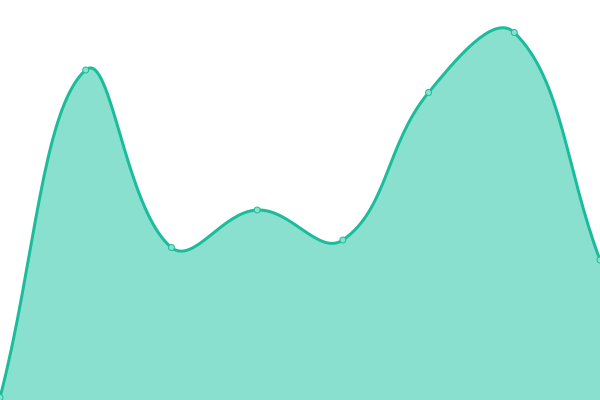
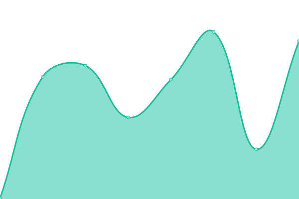
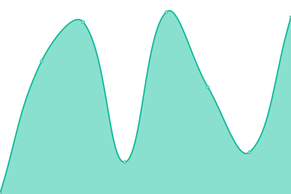

# [📈 Live Status](https://demo.upptime.js.org): <!--live status--> **🟧 Partial outage**

This repository contains the open-source uptime monitor and status page for [Upptime](https://upptime.js.org), powered by [Upptime](https://github.com/upptime/upptime).

With [Upptime](https://upptime.js.org), you can get your own unlimited and free uptime monitor and status page, powered entirely by a GitHub repository. We use [Issues](https://github.com/upptime/upptime/issues) as incident reports, [Actions](https://github.com/upptime/upptime/actions) as uptime monitors, and [Pages](https://demo.upptime.js.org) for the status page.

<!--start: status pages-->
<!-- This summary is generated by Upptime (https://github.com/upptime/upptime) -->
<!-- Do not edit this manually, your changes will be overwritten -->
<!-- prettier-ignore -->
| URL | Status | History | Response Time | Uptime |
| --- | ------ | ------- | ------------- | ------ |
|  [Google](https://www.google.com) | 🟩 Up | [google.yml](https://github.com/brankhsu/upptime/commits/HEAD/history/google.yml) | 

 65ms
     
 | 

<a href="https://demo.upptime.js.org/history/google">100.00%</a>
    

|  [Wikipedia](https://en.wikipedia.org) | 🟩 Up | [wikipedia.yml](https://github.com/brankhsu/upptime/commits/HEAD/history/wikipedia.yml) | 

 648ms
     
 | 

<a href="https://demo.upptime.js.org/history/wikipedia">100.00%</a>
    

|  [Hacker News](https://news.ycombinator.com) | 🟩 Up | [hacker-news.yml](https://github.com/brankhsu/upptime/commits/HEAD/history/hacker-news.yml) | 

 430ms
     
 | 

<a href="https://demo.upptime.js.org/history/hacker-news">100.00%</a>
    

|  [Test Broken Site](https://thissitedoesnotexist.koj.co) | 🟥 Down | [test-broken-site.yml](https://github.com/brankhsu/upptime/commits/HEAD/history/test-broken-site.yml) | 

 0ms
     
 | 

<a href="https://demo.upptime.js.org/history/test-broken-site">100.00%</a>
    

|  [youtube](https://www.youtube.com/) | 🟩 Up | [youtube.yml](https://github.com/brankhsu/upptime/commits/HEAD/history/youtube.yml) | 

 229ms
     
 | 

<a href="https://demo.upptime.js.org/history/youtube">100.00%</a>
    

|  [my site](https://140.115.81.225/brankhsu/index.html) | 🟩 Up | [my-site.yml](https://github.com/brankhsu/upptime/commits/HEAD/history/my-site.yml) | 

 811ms
     
 | 

<a href="https://demo.upptime.js.org/history/my-site">100.00%</a>
    

|  [twitch](https://www.twitch.tv/) | 🟩 Up | [twitch.yml](https://github.com/brankhsu/upptime/commits/HEAD/history/twitch.yml) | 

 53ms
     
 | 

<a href="https://demo.upptime.js.org/history/twitch">100.00%</a>
    

|  [NCU class selection system](https://portal.ncu.edu.tw/system/35?token=LEIobaDsecQKRNzCzJLJZWEYoMX) | 🟩 Up | [ncu-class-selection-system.yml](https://github.com/brankhsu/upptime/commits/HEAD/history/ncu-class-selection-system.yml) | 

 1873ms
     
 | 

<a href="https://demo.upptime.js.org/history/ncu-class-selection-system">100.00%</a>
    

|  [leetcode](https://leetcode.com/problemset/all/) | 🟥 Down | [leetcode.yml](https://github.com/brankhsu/upptime/commits/HEAD/history/leetcode.yml) | 

 0ms
     
 | 

<a href="https://demo.upptime.js.org/history/leetcode">13.85%</a>
    

|  [test issue](https://www.guugle.com) | 🟥 Down | [test-issue.yml](https://github.com/brankhsu/upptime/commits/HEAD/history/test-issue.yml) | 

 0ms
     
 | 

<a href="https://demo.upptime.js.org/history/test-issue">4.71%</a>
    

<!--end: status pages-->

[**Visit our status website →**](https://demo.upptime.js.org)

## 📄 License

- Powered by: [Upptime](https://github.com/upptime/upptime)
- Code: [MIT](./LICENSE) © [Upptime](https://upptime.js.org)
- Data in the `./history` directory: [Open Database License](https://opendatacommons.org/licenses/odbl/1-0/)
